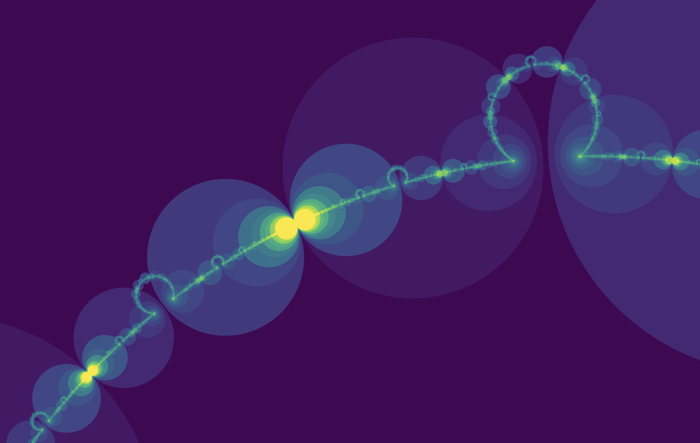
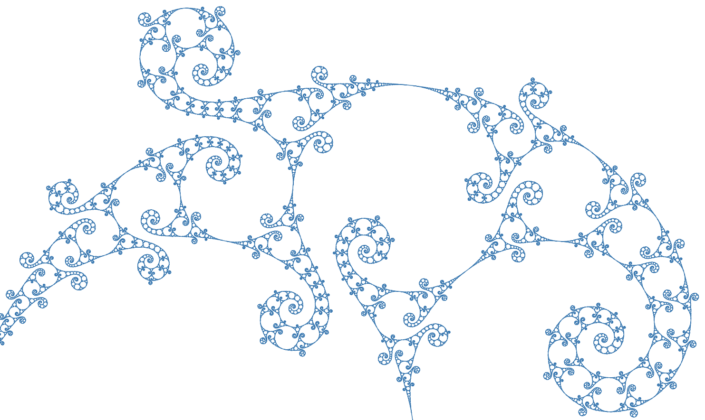

# indra

Projects from the book [Indra's Pearls](http://klein.math.okstate.edu/IndrasPearls/).

### To-do's

* plotting stretches of limit set (ch. 6)
* animation of changing parameters of recipes
* generalized special words algorithm (ch. 8)
